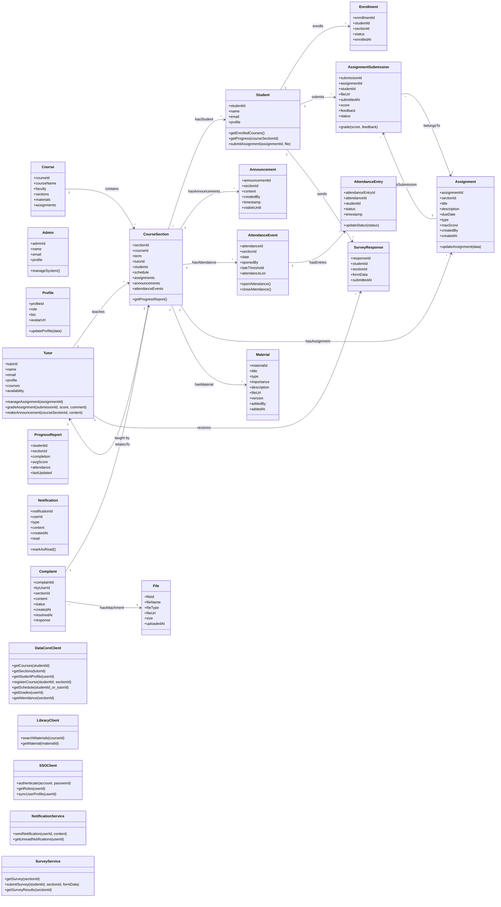

---

## **Ghi chú liệt kê giá trị enum/document ngoài diagram:**
- **Role**: STUDENT, TUTOR, ADMIN, OFFICER  
- **EnrollmentStatus**: ENROLLED, DROPPED, COMPLETED, WAITLIST  
- **AssignmentType**: QUIZ, HOMEWORK, PROJECT  
- **SubmissionStatus**: SUBMITTED, GRADED, LATE, REJECTED  
- **MaterialType**: SYLLABUS, SLIDE, TEXTBOOK, EXERCISE, ANNOUNCEMENT, OTHER  
- **MaterialImportance**: REQUIRED, OPTIONAL  
- **AttendanceStatus**: PRESENT, LATE, ABSENT  
- **NotificationType**: DEADLINE, ANNOUNCEMENT, EVENT, FEEDBACK, SYSTEM  
- **ComplaintStatus**: OPEN, IN_PROGRESS, RESOLVED, REJECTED

---

**Nếu vẫn lỗi:**
- Đọc lại doc [Mermaid class diagram for GitHub](https://docs.github.com/get-started/writing-on-github/working-with-advanced-formatting/creating-diagrams#creating-class-diagrams-and-state-diagrams)
- Nhớ: Không dùng enum, interface, stereotype.
- Không khai báo kiểu và thuộc tính kiểu chi tiết (chỉ ghi tên thuộc tính, phương thức).
- Đặt các giá trị enum dưới diagram bằng bảng hoặc ghi chú.

Nếu muốn mình xuất lại full file bằng markdown (để copy vào README hoặc báo cáo), bảo mình nhé!

## 2. Method List & Description (Domain + Services + Adapter)

| **Class/Service**              | **Method/Signature**                                                        | **Purpose / Description**                                                                                                                                          | **UC Mapping**                                    | **Error/Notes**                                      |
|-----------------------------|--------------------------------------------------------------------------|------------------------------------------------------------------------------------------------------------------------------------------------------------------|---------------------------------------------------|------------------------------------------------------|
| **Student**                | getEnrolledCourses()                                                      | Trả về danh sách các môn/lớp sinh viên đang học                                                                                                                  | UC21, UC20                                        | 404 nếu không có Enrollment                          |
|                             | getProgress(courseSectionId)                                             | Lấy tiến độ học tập, điểm trung bình, số lần điểm danh etc cho từng môn                                                    | UC10, UC24, UC44                                  |                                                      |
|                             | submitAssignment(assignmentId, file)                                     | Nộp bài tập, kiểm tra thời hạn, định dạng, lưu file submission.                                                            | UC15, UC39                                        | 403 nếu hết hạn; 400 nếu sai format                  |
| **Tutor**                   | manageAssignment(assignmentId)                                           | Thêm/sửa/xóa bài tập, lọc bài nộp, xem thông tin chi tiết                                                                  | UC39, UC38                                        | 404 nếu không tồn tại; 403 nếu không có quyền        |
|                             | gradeAssignment(submissionId, score, comment)                            | Chấm điểm & phản hồi cho sinh viên                                                                                         | UC39                                              | 404 nếu submission không tồn tại                     |
|                             | makeAnnouncement(sectionId, content)                                     | Tạo thông báo cho lớp/môn                                                                                                  | UC32, UC22                                        | Rate-limit nếu spam                                  |
|                             | replyComplaint(complaintId, response)                                    | Phản hồi khiếu nại từ SV                                                                                                   | UC17, UC30                                        | Log/Audit                                            |
| **Admin**                   | manageSystem()                                                           | Quản trị hệ thống                                                                                                          | UC37                                              | Chỉ cho role ADMIN                                   |
| **Enrollment**              | enroll(studentId, sectionId)                                             | Đăng ký lớp cho sinh viên                                                                                                  | UC27, UC9                                         | Check prerequisite, time conflict, chỗ trống         |
| **AssignmentSubmission**    | grade(score, feedback)                                                   | Ghi điểm và nhận xét cho bài nộp                                                                                          | UC39                                              |                                                      |
| **Announcement**            | markAsRead()                                                             | Đánh dấu thông báo đã đọc                                                                                                  | UC16, UC22                                        |                                                      |
| **AttendanceEvent**         | openAttendance()                                                         | Mở sự kiện điểm danh                                                                                                       | UC25, UC47                                        | Chỉ Tutor/GV                                         |
|                             | closeAttendance()                                                        | Đóng sự kiện điểm danh                                                                                                     | UC47                                              |                                                      |
| **AttendanceEntry**         | updateStatus(status)                                                     | Điều chỉnh trạng thái điểm danh                                                                                           | UC47                                              |                                                      |
| **SurveyResponse**          | submitSurvey(sectionId, formData)                                        | Sinh viên gửi survey/feedback môn học                                                                                      | UC18, UC8, UC31, UC40                             | Chỉ 1 lần/môn/1 SV                                   |
| **Complaint**               | submitComplaint(byUserId, sectionId, content, files)                     | Tạo khiếu nại mới                                                                                                          | UC17, UC30, UC36                                  | 400 thiếu dữ liệu                                    |
| **DataCoreClient**          | getCourses(studentId)                                                    | Truy vấn danh sách môn/lớp theo SV                                                                                         | UC21, UC20, UC41, UC45                            | Integration error                                    |
|                             | registerCourse(studentId, sectionId)                                     | Đăng ký môn học kỳ sau                                                                                                     | UC27, UC42                                        | Race, conflict, check rule                           |
|                             | getGrades(userId)                                                        | Lấy bảng điểm                                                                                                              | UC24, UC38, UC44                                  |                                                      |
|                             | getAttendance(sectionId)                                                 | Lấy thông tin điểm danh từng buổi                                                                                         | UC25, UC47                                        |                                                      |
| **LibraryClient**           | searchMaterials(courseId)                                                | Truy vấn tài liệu từ thư viện                                                                                              | UC19, UC5, UC4                                    | 504 nếu timeout; 404 nếu không có                    |
|                             | getMaterial(materialId)                                                  | Lấy metadata chi tiết cho tài liệu                                                                                         | UC19                                              |                                                      |
| **SSOClient**               | authenticate(account, password)                                          | Đăng nhập xác thực                                                                   | UC6, UC33                                         | 401/403                                              |
|                             | getRoles(userId)                                                         | Trả danh sách quyền của user                                                         | UC6, UC33, UC34                                   |                                                      |
| **NotificationService**     | sendNotification(userId, content)                                        | Gửi thông báo đến user (SV/Tutor/Staff/Admin)                                        | UC22, UC23, UC32, UC43                            |                                                      |
|                             | getUnreadNotifications(userId)                                           | Lấy danh sách thông báo chưa đọc                                                      | UC16, UC22                                        |                                                      |
| **SurveyService**           | getSurvey(sectionId)                                                     | Lấy form khảo sát cho từng môn/lớp                                                   | UC18, UC8, UC31, UC40                             |                                                      |
|                             | submitSurvey(studentId, sectionId, formData)                             | Lưu khảo sát, kiểm tra hợp lệ                                                        | UC18                                              | 400 thiếu bắt buộc, 409 đã tồn tại                   |
|                             | getSurveyResults(sectionId)                                              | Lấy thống kê khảo sát với môn/lớp                                                    | UC8, UC31, UC40                                   |                                                      |

---

**Ghi chú:**  
- Tất cả class/method đều có thể được mapping với sequence diagram bạn đã gửi, hoặc có cùng logic: actor → UI/Form → Controller → Service/Adapter → Database hoặc hệ thống tích hợp (DATACORE, LIBRARY, SSO).
- Nếu có entity nào cần tách nhỏ/thêm field, bạn cứ bổ sung để diagram chi tiết hơn.

---

## Next steps

- Nếu cần chia nhỏ diagram cho từng module: Student, Tutor, Admin; mình có thể tách lại.
- Nếu muốn export thêm bản PlantUML, PDF, hoặc README mapping diagram ↔ sequence diagram, báo lại nhé!
- Nếu nhóm bạn có review, sửa lại entity/field/method nào bạn gửi, cứ gửi lại để mình cập nhật bản cuối!

Bạn chỉ việc copy và dùng file trên, mapping cho Submission #3, đã khớp với toàn bộ UC và sequence diagram bạn đã cung cấp!
