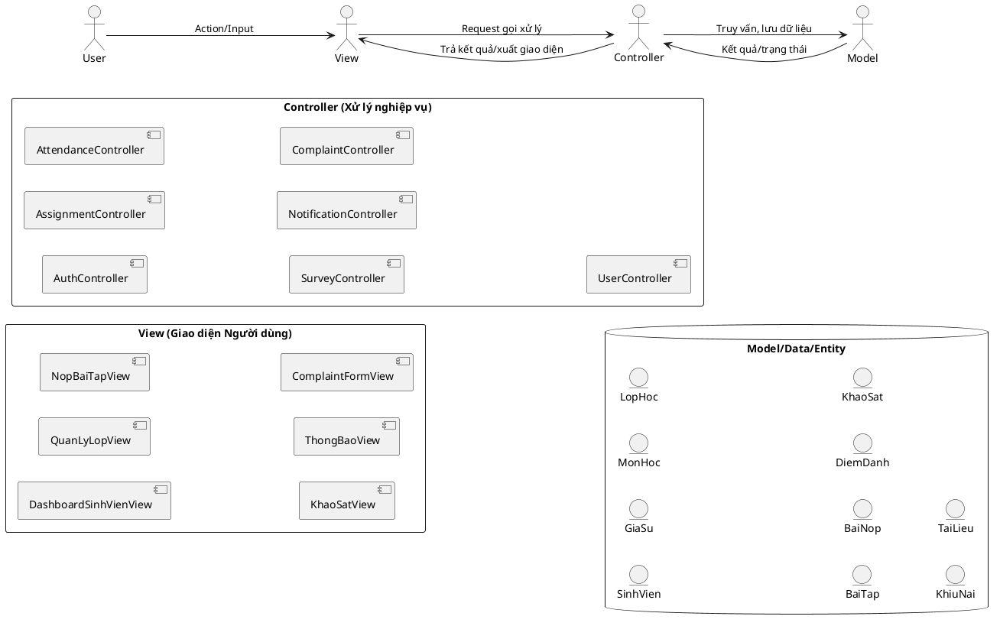

### 3.1.1 Sử dụng kiến trúc phân lớp để thiết kế hệ thống Mentor/Tutor HCMUT

Hệ thống Mentor/Tutor HCMUT được xây dựng dựa trên mô hình kiến trúc **MVC (Model-View-Controller)** — một mô hình phân lớp phổ biến, đáp ứng tiêu chí tách biệt nghiệp vụ, giao diện và xử lý yêu cầu. Cụ thể:

- **View (Giao diện):**
  - Hiển thị dữ liệu cho người dùng, nhận các thao tác như nhập liệu, nhấn nút, duyệt giao diện các chức năng (quản lý môn học, điểm danh, nộp bài, khảo sát...).
  - Ví dụ: Trang đăng nhập, dashboard sinh viên, quản lý bài tập, làm khảo sát, lịch sử điểm danh.
  - Các components chính:  
    + DashboardSinhVienView  
    + QuanLyLopView  
    + NopBaiTapView  
    + KhaoSatView  
    + ThongBaoView  
    + ComplaintFormView  

- **Controller (Bộ xử lý yêu cầu):**
  - Tiếp nhận, phân tích request từ View, xác thực, xử lý logic, gọi tới Model/service, trả kết quả về View.
  - Điều phối tương tác nghiệp vụ: phân quyền, xác thực, quản lý bài tập, điểm danh, xử lý khảo sát, quản lý khiếu nại...
  - Các controller chính:  
    + AuthController  
    + AssignmentController  
    + AttendanceController  
    + SurveyController  
    + NotificationController  
    + ComplaintController  
    + UserController  

- **Model (Dữ liệu & logic):**
  - Xử lý kết nối dữ liệu, lưu trữ & thao tác trên entity theo business: Student, Tutor, Course, Assignment...
  - Tương tác Database và hệ APIs: HCMUT_DATACORE, HCMUT_LIBRARY, HCMUT_SSO.
  - Các schema chính:  
    + SinhVien (Student)  
    + GiaSu (Tutor)  
    + MonHoc (Course)  
    + LopHoc (CourseSection)  
    + BaiTap (Assignment)  
    + BaiNop (AssignmentSubmission)  
    + DiemDanh (AttendanceEvent, AttendanceEntry)  
    + KhaoSat (SurveyResponse)  
    + KhiuNai (Complaint)  
    + TaiLieu (Material)  

---

#### **Sơ đồ kiến trúc MVC của hệ Mentor/Tutor**

---

### **Mô tả dòng dữ liệu**

- Người dùng thao tác trên giao diện (View) sẽ gửi yêu cầu tới Controller (ví dụ nộp bài, tạo phiếu điểm danh).
- Controller nhận request, xác thực dữ liệu, gọi model/database hoặc các dịch vụ ngoài (ví dụ lấy dữ liệu từ HCMUT_DATACORE, kiểm tra file từ HCMUT_LIBRARY, xác thực user với HCMUT_SSO).
- Model nhận, xử lý & lưu thông tin, phản hồi lại kết quả cho Controller.
- Controller gửi trạng thái/response về cho View.  
- View (trang web/app) cập nhật realtime trạng thái phản hồi cho người dùng.

---

### **Mô hình này giúp:**
- **Tách biệt logic, giao diện, dữ liệu:**  
  Nhóm UI, backend, database có thể phát triển độc lập, dễ bảo trì.
- **Kiểm thử & mở rộng dễ dàng:**  
  Phát triển thêm chức năng (nộp bài, khảo sát, quản lý lớp...) mà ít ảnh hưởng các phần còn lại.
- **Tích hợp dễ dàng với API ngoài** như HCMUT SSO, Library, DataCore...

---

**Bạn dùng phần này copy vào báo cáo Submission #3 cho mục Development/Implementation View.  
Nếu muốn vẽ thêm các lớp chi tiết hoặc bổ sung package schematic, chỉ cần báo lại!**
