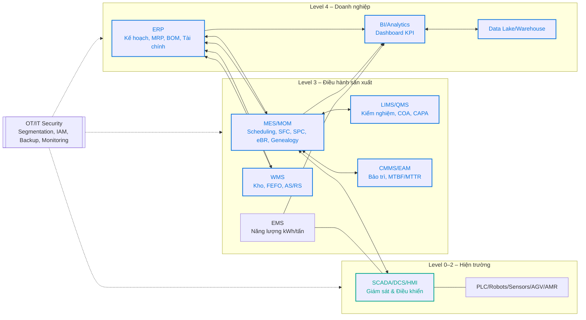
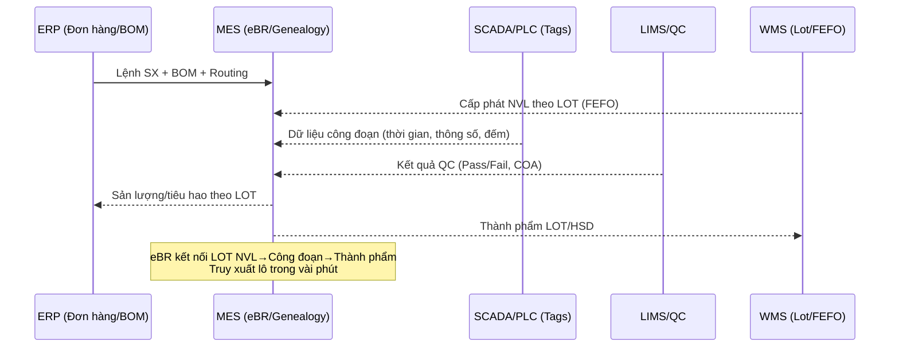

# Sơ đồ minh họa: ERP – MES – SCADA/IoT – OEE – SCOR – acatech

Ghi chú:
- Đây là sơ đồ khái niệm có thể dùng trực tiếp trong báo cáo. Bạn có thể sửa nhãn/tên hệ thống cho khớp thực tế.
- Các sơ đồ dùng Mermaid. Dán vào Markdown/GitHub đều hiển thị được.

---

## 1) Kiến trúc tích hợp IT/OT theo ISA‑95 (End‑to‑End)



Chú thích:
- Đường xanh dương (API/ESB/ETL): tích hợp dữ liệu/ứng dụng giữa các hệ thống.
- Đường xanh lục (OPC UA/MQTT/Fieldbus): kết nối OT (SCADA/PLC/thiết bị).

---

## 2) Quy trình SCOR và hệ thống hỗ trợ

```mermaid
flowchart TB
  %% SCOR Phân rã và gán hệ thống
  subgraph PLAN [Plan]
    P1[Forecast & S&OP]
    P2[MPS/MRP (ERP)]
    P3[Finite Scheduling (MES)]
  end

  subgraph SOURCE [Source]
    S1[Mua sắm (ERP)]
    S2[Tiếp nhận & QC (LIMS)]
    S3[Putaway/FEFO (WMS)]
  end

  subgraph MAKE [Make]
    M1[Điều độ & Thực thi (MES)]
    M2[Giám sát công đoạn (SCADA/PLC)]
    M3[SPC & eBR (MES/LIMS)]
    M4[Genealogy/Trace (MES)]
    M5[Bảo trì (CMMS)]
    M6[Quản lý năng lượng (EMS)]
  end

  subgraph DELIVER [Deliver]
    D1[Pick/Pack (WMS)]
    D2[Outbound & TMS (ERP/TMS)]
  end

  subgraph RETURN [Return]
    R1[Nonconformance & CAPA (QMS)]
    R2[Truy xuất & Thu hồi (MES/ERP)]
  end

  P1 --> P2 --> P3 --> S1
  S1 --> S2 --> S3 --> M1
  M1 --> M2 --> M3 --> M4 --> D1 --> D2
  M3 --> R1
  M4 --> R2
```

---

## 3) Dòng dữ liệu OEE (Availability–Performance–Quality)

```mermaid
flowchart TB
  subgraph Sources [Nguồn dữ liệu]
    SC1[SCADA/HMI<br/>Trạng thái máy, thời gian dừng, tốc độ]
    SC2[Cảm biến đếm sản phẩm]
    MES1[MES/SFC<br/>Lệnh, sản lượng, thời gian ca]
    LIMS1[LIMS/QC<br/>Pass/Fail, COA]
  end

  subgraph Metrics [Thành phần OEE]
    A[Availability<br/>Run Time / Planned Time]
    P[Performance<br/>(Ideal Cycle × Total Count)/Run Time]
    Q[Quality<br/>Good/Total]
  end

  subgraph KPI [KPI]
    OEE[OEE = A × P × Q]
    FPY[FPY]
    Pareto[Downtime Pareto]
  end

  SC1 --> A
  MES1 --> A
  SC1 --> P
  SC2 --> P
  MES1 --> P
  MES1 --> Q
  LIMS1 --> Q

  A --> OEE
  P --> OEE
  Q --> OEE
  SC1 --> Pareto
```

Gợi ý dashboard: OEE theo ca/line, Top 10 downtime, FPY, tốc độ thực tế vs. chuẩn, kWh/tấn theo line.

---

## 4) Bậc trưởng thành số hóa theo acatech (ví dụ minh họa)

```mermaid
flowchart LR
  L1[1. Computerization<br/>Phần mềm rời rạc, Excel, ERP cơ bản] --> 
  L2[2. Connectivity<br/>Kết nối ERP–MES; SCADA thu thập tự động] --> 
  L3[3. Visibility<br/>Dashboard thời gian thực (OEE, năng lượng)] --> 
  L4[4. Transparency<br/>Phân tích nguyên nhân gốc, mô hình quá trình] --> 
  L5[5. Predictability<br/>Dự báo hỏng hóc (PdM), dự báo chất lượng/năng lực] --> 
  L6[6. Adaptability<br/>Tối ưu/lập lịch tự động, điều chỉnh theo thời gian thực]

  click L1 "#" "Mức 1"
  click L2 "#" "Mức 2"
  click L3 "#" "Mức 3"
  click L4 "#" "Mức 4"
  click L5 "#" "Mức 5"
  click L6 "#" "Mức 6"
```

Cách dùng:
- Đánh dấu mức hiện tại cho từng trụ cột (Processes, Resources, Information Systems, Organization, Culture, Compliance) bằng bảng/phiếu chấm điểm kèm minh chứng.
- Lập lộ trình nâng bậc (ví dụ: từ Visibility → Transparency bằng việc chuẩn hóa dữ liệu + triển khai SPC nâng cao + phân tích nguyên nhân gốc).

---

## 5) Sơ đồ tích hợp dữ liệu truy xuất lô (Genealogy/eBR)



---

Nếu bạn muốn mình tùy biến các sơ đồ theo tên nhà máy/dây chuyền/kho cụ thể (ví dụ “Nhà máy Bình Dương: Line UHT 1, Kho AS/RS”), hãy gửi danh sách để mình chỉnh nhãn và thêm ghi chú kỹ thuật (OPC UA tag, API, bảng KPI).
