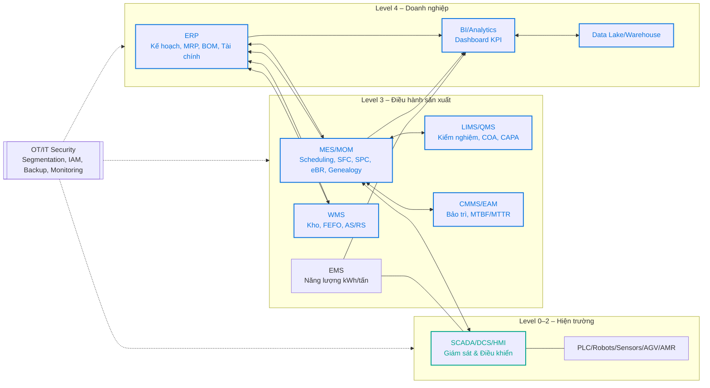
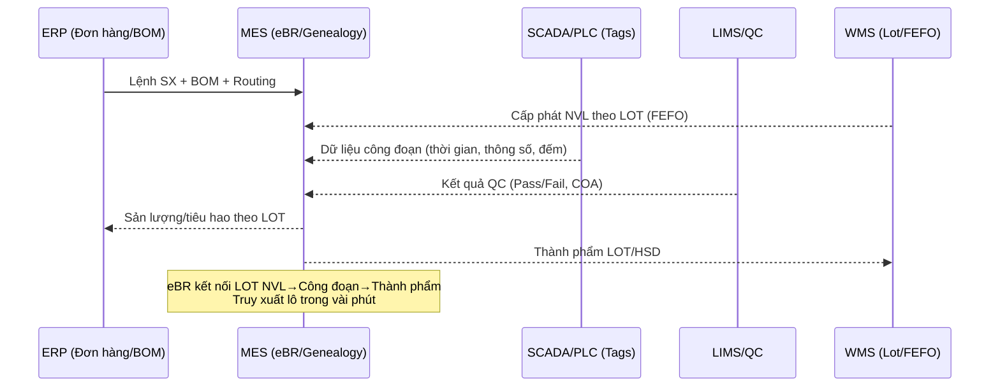

# Sơ đồ minh họa: ERP – MES – SCADA/IoT – OEE – SCOR – acatech

Ghi chú:
- Đây là sơ đồ khái niệm có thể dùng trực tiếp trong báo cáo. Bạn có thể sửa nhãn/tên hệ thống cho khớp thực tế.
- Các sơ đồ dùng Mermaid. Dán vào Markdown/GitHub đều hiển thị được.

---

## 1) Kiến trúc tích hợp IT/OT theo ISA‑95 (End‑to‑End)



Chú thích:
- Đường xanh dương (API/ESB/ETL): tích hợp dữ liệu/ứng dụng giữa các hệ thống.
- Đường xanh lục (OPC UA/MQTT/Fieldbus): kết nối OT (SCADA/PLC/thiết bị).

---

## 2) Quy trình SCOR và hệ thống hỗ trợ (đã sửa)

```mermaid
flowchart TB
  %% SCOR phân rã và gán hệ thống
  subgraph PLAN [Plan]
    P1[Forecast and Sales and Operations Planning]
    P2[MPS and MRP (ERP)]
    P3[Finite scheduling (MES)]
  end

  subgraph SOURCE [Source]
    S1[Procurement (ERP)]
    S2[Inbound receiving and QC (LIMS)]
    S3[Putaway and FEFO (WMS)]
  end

  subgraph MAKE [Make]
    M1[Dispatch and execution (MES)]
    M2[Process monitoring (SCADA and PLC)]
    M3[SPC and eBR (MES and LIMS)]
    M4[Genealogy and Traceability (MES)]
    M5[Maintenance (CMMS)]
    M6[Energy management (EMS)]
  end

  subgraph DELIVER [Deliver]
    D1[Pick and Pack (WMS)]
    D2[Outbound and TMS (ERP or TMS)]
  end

  subgraph RETURN [Return]
    R1[Nonconformance and CAPA (QMS)]
    R2[Recall and Trace (MES and ERP)]
  end

  P1 --> P2 --> P3 --> S1
  S1 --> S2 --> S3 --> M1
  M1 --> M2 --> M3 --> M4 --> D1 --> D2
  M3 --> R1
  M4 --> R2
```

---

## 3) Dòng dữ liệu OEE (đã sửa)

```mermaid
flowchart TB
  subgraph Sources [Data sources]
    SC1[SCADA HMI: machine state, downtime, speed]
    SC2[Sensors: product counter]
    MES1[MES: orders, output, shift time]
    LIMS1[LIMS QC: pass or fail, COA]
  end

  subgraph Metrics [OEE components]
    A[Availability = Run Time / Planned Time]
    P[Performance = (Ideal Cycle Time x Total Count) / Run Time]
    Q[Quality = Good Count / Total Count]
  end

  subgraph KPI [KPIs]
    OEE[OEE = Availability x Performance x Quality]
    FPY[First Pass Yield (FPY)]
    Pareto[Downtime Pareto]
  end

  SC1 --> A
  MES1 --> A

  SC1 --> P
  SC2 --> P
  MES1 --> P

  MES1 --> Q
  LIMS1 --> Q

  A --> OEE
  P --> OEE
  Q --> OEE

  SC1 --> Pareto
```

---

## 4) Bậc trưởng thành số hóa theo acatech (đã sửa)

```mermaid
flowchart LR
  L1[1. Computerization - basic IT and ERP]
  L2[2. Connectivity - connected systems and data collection]
  L3[3. Visibility - real time dashboards (OEE and energy)]
  L4[4. Transparency - root cause analysis and process models]
  L5[5. Predictability - predictive maintenance and forecasting]
  L6[6. Adaptability - self optimization and dynamic scheduling]

  L1 --> L2 --> L3 --> L4 --> L5 --> L6
```

Cách dùng:
- Đánh dấu mức hiện tại cho từng trụ cột (Processes, Resources, Information Systems, Organization, Culture, Compliance) bằng bảng/phiếu chấm điểm kèm minh chứng.
- Lập lộ trình nâng bậc (ví dụ: từ Visibility → Transparency bằng việc chuẩn hóa dữ liệu + triển khai SPC nâng cao + phân tích nguyên nhân gốc).

---

## 5) Sơ đồ tích hợp dữ liệu truy xuất lô (Genealogy/eBR)



---

Nếu bạn muốn mình tùy biến các sơ đồ theo tên nhà máy/dây chuyền/kho cụ thể (ví dụ “Nhà máy Bình Dương: Line UHT 1, Kho AS/RS”), hãy gửi danh sách để mình chỉnh nhãn và thêm ghi chú kỹ thuật (OPC UA tag, API, bảng KPI).
