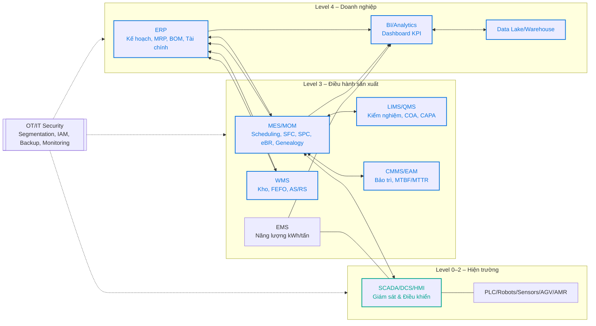
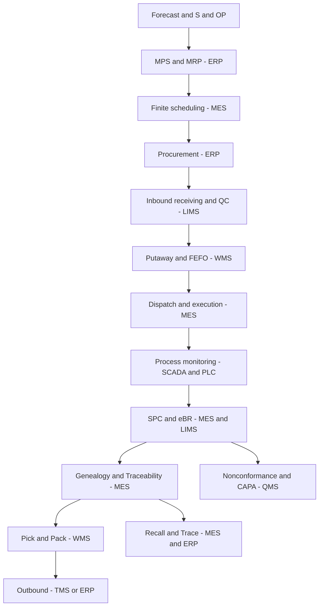
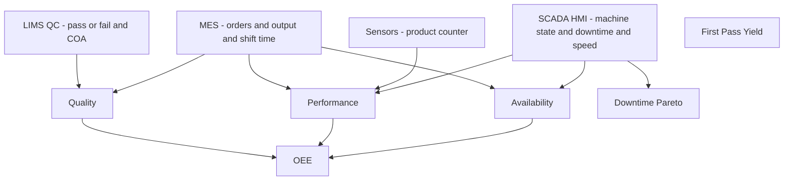
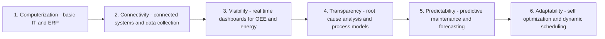
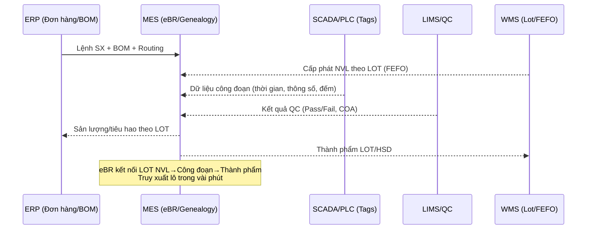

# Sơ đồ minh họa: ERP – MES – SCADA/IoT – OEE – SCOR – acatech

Ghi chú:
- Đây là sơ đồ khái niệm có thể dùng trực tiếp trong báo cáo. Bạn có thể sửa nhãn/tên hệ thống cho khớp thực tế.
- Các sơ đồ dùng Mermaid. Dán vào Markdown/GitHub đều hiển thị được.

---

## 1) Kiến trúc tích hợp IT/OT theo ISA‑95 (End‑to‑End)

Chú thích:
- Đường xanh dương (API/ESB/ETL): tích hợp dữ liệu/ứng dụng giữa các hệ thống.
- Đường xanh lục (OPC UA/MQTT/Fieldbus): kết nối OT (SCADA/PLC/thiết bị).

---

## SCOR flow (phiên bản an toàn cho GitHub)

## OEE data flow (phiên bản an toàn cho GitHub)
Lưu ý: công thức sẽ ghi ngoài sơ đồ để tránh lỗi parser:
- Availability = Run Time / Planned Time
- Performance = Ideal Cycle Time x Total Count / Run Time
- Quality = Good Count / Total Count
- OEE = Availability x Performance x Quality

## acatech levels (phiên bản an toàn cho GitHub)

Cách dùng:
- Đánh dấu mức hiện tại cho từng trụ cột (Processes, Resources, Information Systems, Organization, Culture, Compliance) bằng bảng/phiếu chấm điểm kèm minh chứng.
- Lập lộ trình nâng bậc (ví dụ: từ Visibility → Transparency bằng việc chuẩn hóa dữ liệu + triển khai SPC nâng cao + phân tích nguyên nhân gốc).

---

## 5) Sơ đồ tích hợp dữ liệu truy xuất lô (Genealogy/eBR)

---

Nếu bạn muốn mình tùy biến các sơ đồ theo tên nhà máy/dây chuyền/kho cụ thể (ví dụ “Nhà máy Bình Dương: Line UHT 1, Kho AS/RS”), hãy gửi danh sách để mình chỉnh nhãn và thêm ghi chú kỹ thuật (OPC UA tag, API, bảng KPI).

# Checklist khoảng trống còn thiếu để hoàn thiện bài

## 1) Dẫn liệu & trích dẫn case Vinamilk
- [ ] Bảng evidence map: mỗi khẳng định có 1 đường link nguồn
- [ ] Nêu rõ nhà máy/dây chuyền minh họa
- [ ] Tên nền tảng/nhà cung cấp (nếu công khai), năm triển khai
- [ ] Hình ảnh/video minh họa (nguồn YouTube/website chính thức)

## 2) KPI và hình biểu đồ
- [ ] Bảng KPI trước–sau (OEE, FPY, lead time, DOH, kWh/tấn, truy xuất lô)
- [ ] Biểu đồ OEE theo thời gian
- [ ] Pareto downtime theo mã lỗi/cụm nguyên nhân
- [ ] Biểu đồ năng lượng kWh/tấn theo line

## 3) acatech scoring
- [ ] Bảng điểm 6 trụ cột (Processes, Resources, IS, Organization, Culture, Compliance)
- [ ] Minh chứng ngắn cho từng điểm
- [ ] Lộ trình nâng bậc (quick wins → next)

## 4) SCOR – Hệ thống – KPI
- [ ] Bảng mapping Plan/Source/Make/Deliver/Return với ERP/MES/SCADA/WMS/LIMS…
- [ ] KPI tương ứng từng quá trình (Reliability, Responsiveness, Cost, Asset…)

## 5) Phương pháp nghiên cứu chi tiết (Yin)
- [ ] Đơn vị phân tích, ranh giới case
- [ ] Quy trình thu thập dữ liệu, mã hóa định tính
- [ ] Bảo đảm giá trị khoa học: construct/internal/external validity, reliability
- [ ] Đạo đức nghiên cứu và đồng thuận

## 6) Giới hạn & rủi ro thiên lệch
- [ ] Hạn chế dữ liệu, giả định minh họa
- [ ] Cách khắc phục: triangulation, control for confounders

## 7) Tham khảo & phụ lục
- [ ] Tài liệu tham khảo theo APA/IEEE đồng nhất
- [ ] Phụ lục: công thức KPI, evidence map, bảng hỏi, checklist acatech, ma trận rủi ro OT, RACI data
# Mẫu bảng để điền nhanh

## A) Evidence map (khẳng định – nguồn)
| Khẳng định cụ thể | Nhà máy/Phạm vi | Nguồn (link) | Ghi chú kiểm chứng |
|---|---|---|---|
| Vinamilk sử dụng kho tự động AS/RS tại … | Kho TP, Bình Dương? | https://... | Cần ảnh/video xác nhận |
| Tích hợp MES với SCADA theo OPC UA | Line UHT | https://... | Trích dẫn nhà cung cấp |
| Có chuẩn FSSC 22000 tại nhà máy X | Nhà máy X | https://... | … |

## B) KPI trước–sau (ghi nguồn hoặc “minh họa”)
| KPI | Baseline | Sau triển khai | Chênh lệch | Phạm vi/line | Nguồn |
|---|---:|---:|---:|---|---|
| OEE (%) | 68 | 78 | +10 pp | UHT Line 1 | [link] |
| FPY (%) | 95 | 97 | +2 pp | UHT Line 1 | [link] |
| Lead time (giờ) | 48 | 36 | -25% | Nhà máy X | [link] |
| DOH (ngày) | 20 | 17 | -15% | Thành phẩm sữa nước | [link] |
| kWh/tấn | 250 | 230 | -8% | UHT | [link] |
| Truy xuất lô (phút) | 120 | 5 | - | Toàn nhà máy | [link] |

## C) acatech scoring theo trụ cột
| Trụ cột | Mức (1–6) | Minh chứng | Hành động nâng bậc |
|---|:--:|---|---|
| Processes | 3 | Dashboard OEE theo ca | Chuẩn hóa root-cause model, SPC nâng cao |
| Resources | 3 | 80% máy có kết nối | Mở rộng kết nối, chuẩn hóa tag |
| Information Systems | 4 | ERP–MES–SCADA–WMS tích hợp | ESB/API gateway, chuẩn master data |
| Organization | 3 | Vai trò Data steward | Đào tạo quyết định dựa dữ liệu |
| Culture | 2 | Đào tạo OEE cơ bản | Chương trình Kaizen số |
| Compliance | 3 | eBR, truy xuất lô | Tự động hóa chuẩn bị audit |

## D) Mapping SCOR – Hệ thống – KPI
| SCOR | Quy trình chính | Hệ thống hỗ trợ | KPI chính |
|---|---|---|---|
| Plan | Forecast, MPS/MRP | ERP, MES (scheduling) | Forecast accuracy, Plan adherence |
| Source | Tiếp nhận, QC | ERP, LIMS, WMS | Supplier OTIF, QC pass rate |
| Make | Thực thi, QC in-line | MES, SCADA/PLC, LIMS | OEE, FPY, Scrap rate |
| Deliver | Kho, xuất | WMS, ERP/TMS | OTIF, DOH |
| Return | Khiếu nại, CAPA | QMS, MES/ERP | NCR closure time |

## E) Ma trận rủi ro an ninh OT (IEC 62443 – rút gọn)
| Rủi ro | Nguyên nhân | Tác động | Kiểm soát | Mức ưu tiên |
|---|---|---|---|:--:|
| Xâm nhập mạng OT | Phân vùng kém, tài khoản yếu | Ngừng line | Zone/Conduit, MFA, patching, monitoring | Cao |
| Dữ liệu sai lệch | Thiếu validation | Quyết định sai | Data quality checks, lineage | Trung |
| Lock-in nhà cung cấp | Giao thức đóng | Chi phí cao | OPC UA, điều khoản hợp đồng | Trung |

## F) RACI quản trị dữ liệu/KPI
| Hoạt động | R | A | C | I |
|---|---|---|---|---|
| Chuẩn hóa master data | Data steward | Head of Ops | IT/OT | Các nhà máy |
| Xác thực KPI OEE | Process eng. | Plant manager | QA | Finance |
