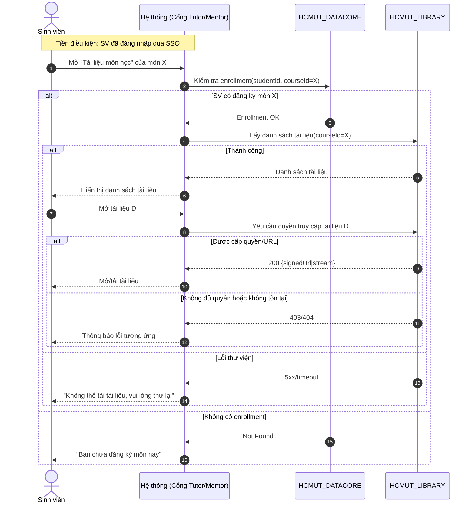
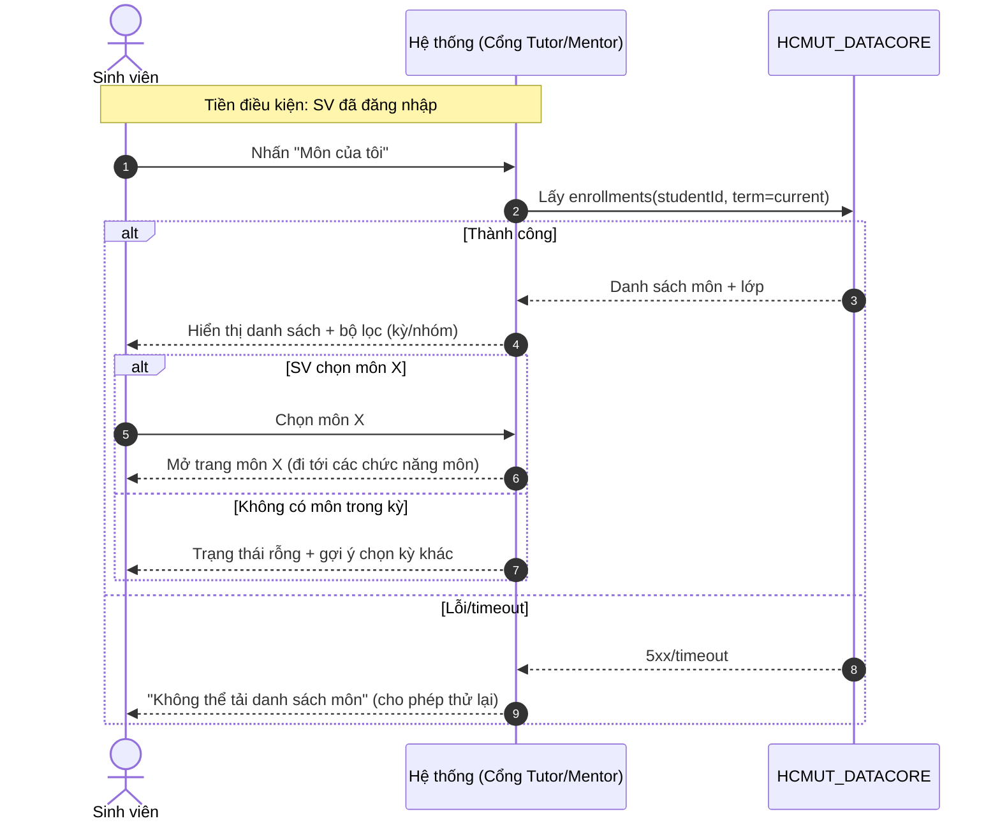
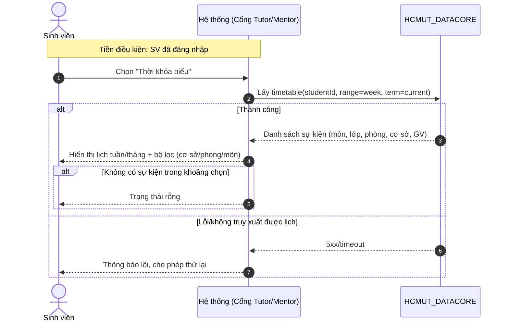
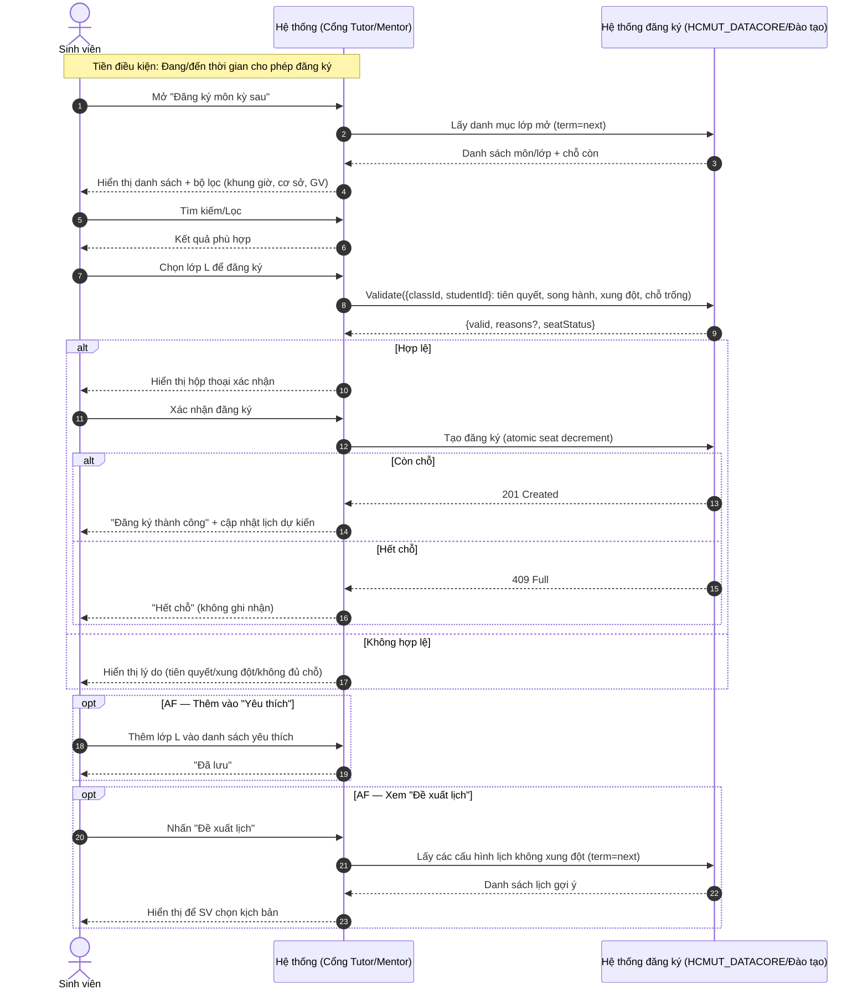

# Sequence Diagrams — Student Use Cases (Black-box System)

Ghi chú
- Subject “Hệ thống (Cổng Tutor/Mentor)” là ứng dụng bạn xây; không phải actor.
- Tiền điều kiện cho các UC: Sinh viên đã đăng nhập qua HCMUT_SSO.
- Không dùng `activate`/`deactivate` để tương thích Mermaid trên GitHub.

## UC: Truy cập tài liệu môn học

## UC: Xem danh sách môn học (đang học)

## UC: Xem thời khóa biểu

## UC: Đăng ký môn học kỳ sau

