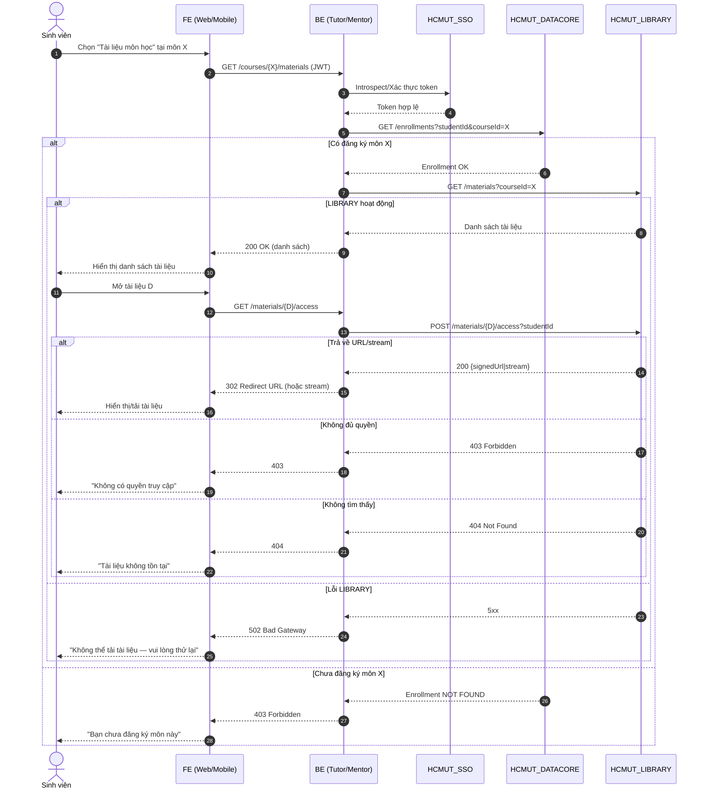
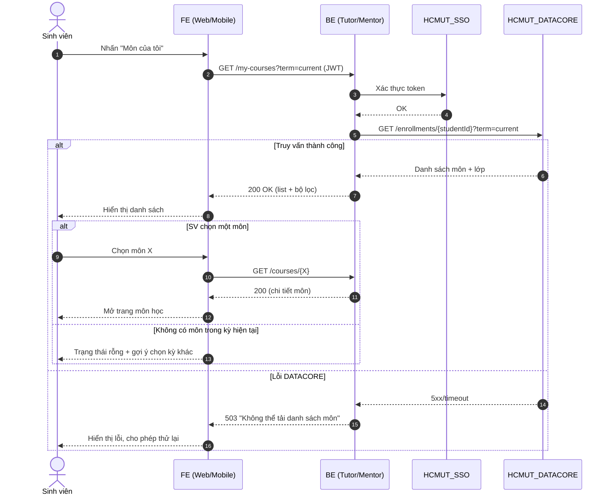
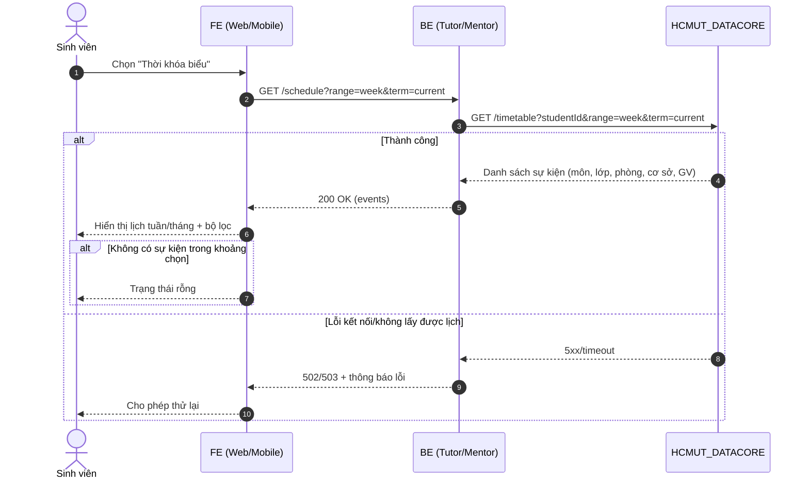
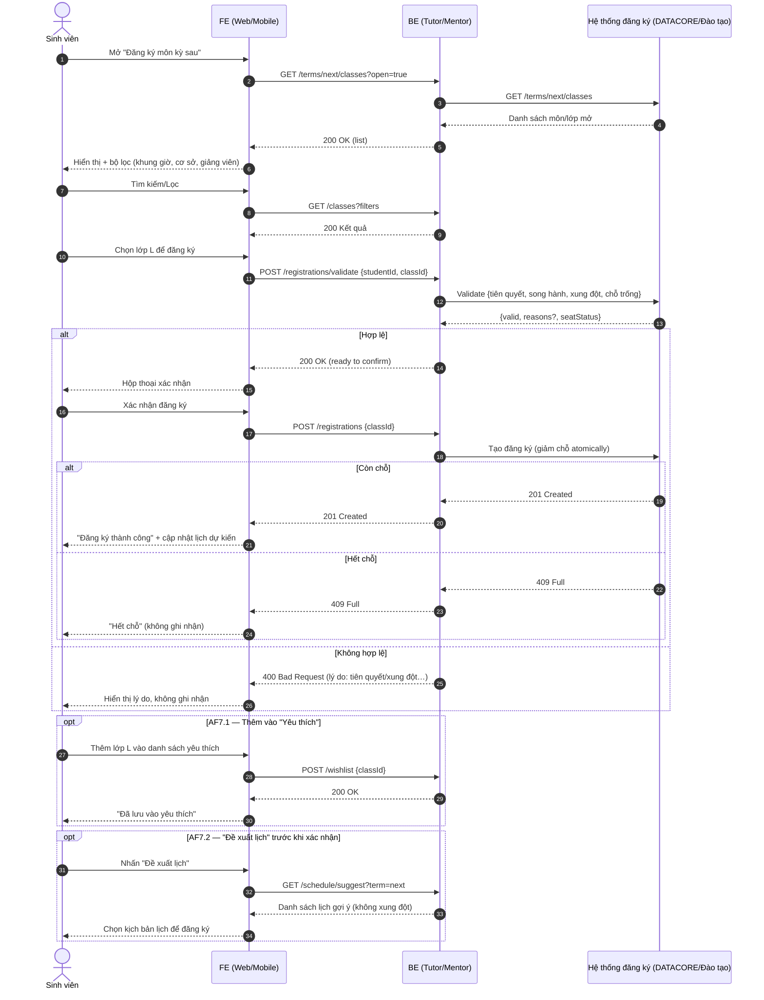

# Sequence Diagrams — Student Flows (Fixed for GitHub Mermaid)

Ghi chú:
- Không dùng `activate`/`deactivate` để tránh lỗi.
- Dùng `alt/else/opt` cho luồng thay thế/ngoại lệ.

## UC: Truy cập tài liệu môn học

## UC: Xem danh sách môn học (đang học)

## UC: Xem thời khóa biểu

## UC: Đăng ký môn học kỳ sau

