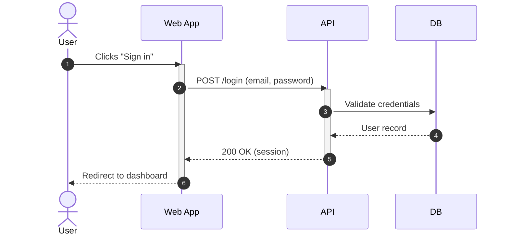

# Demo Sequence Diagram (Mermaid)

Dán khối code Mermaid trong Markdown như bên dưới:

```mermaid
sequenceDiagram
  autonumber

  actor User
  participant Web as Web App
  participant API
  participant DB

  User->>Web: Clicks "Sign in"
  activate Web
  Web->>API: POST /login (email, password)
  activate API
  API->>DB: Validate credentials
  DB-->>API: User record
  API-->>Web: 200 OK (session)
  deactivate API
  Web-->>User: Redirect to dashboard
  deactivate Web
```
