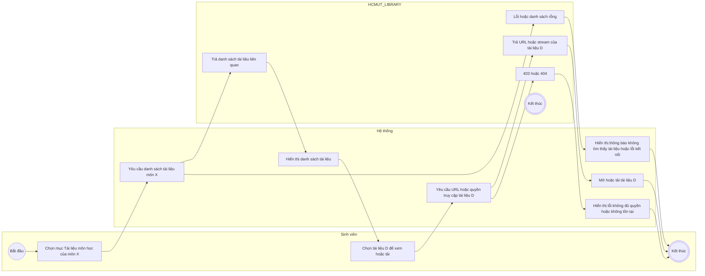
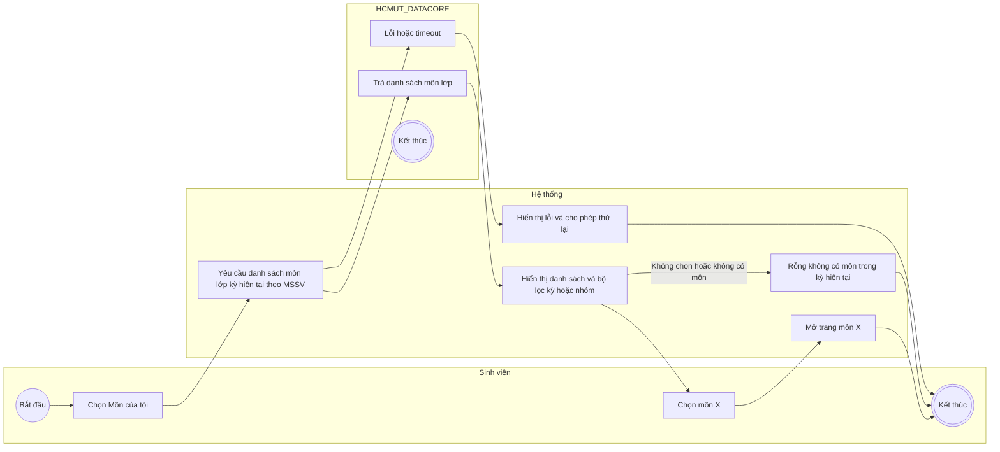
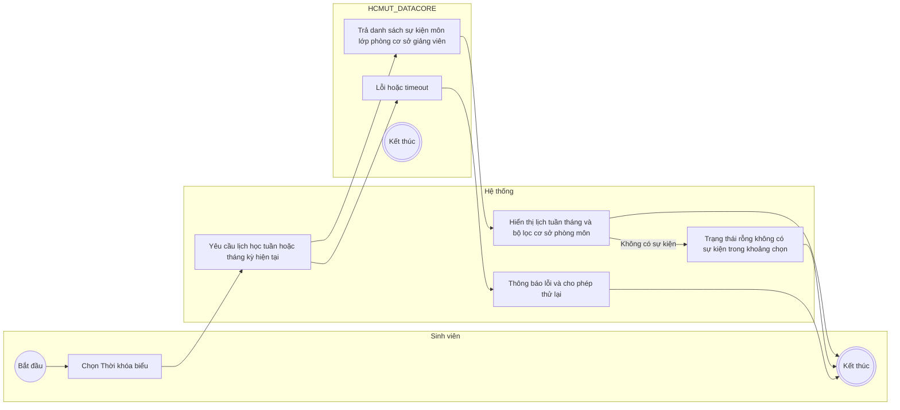
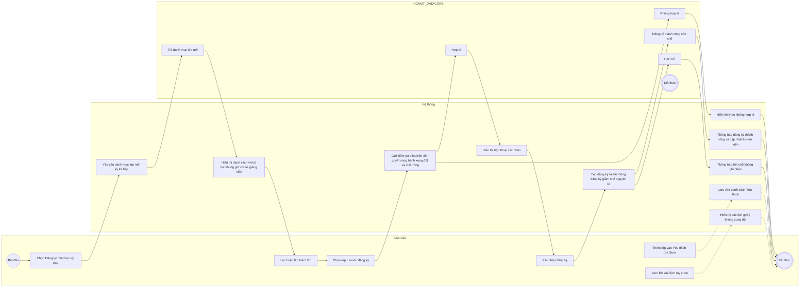

# Activity Diagrams — Student Use Cases (Swimlanes)

Mỗi sơ đồ gồm 3 lane:
- Sinh viên
- Hệ thống
- Dịch vụ tích hợp liên quan: HCMUT_LIBRARY hoặc HCMUT_DATACORE

Lưu ý: Không dùng dấu ngoặc kép trong nhãn để tránh lỗi khi render Mermaid trên GitHub.

---

## 1) Truy cập tài liệu môn học

---

## 2) Xem danh sách môn học đang học

---

## 3) Xem thời khóa biểu

---

## 4) Đăng ký môn học kỳ sau

