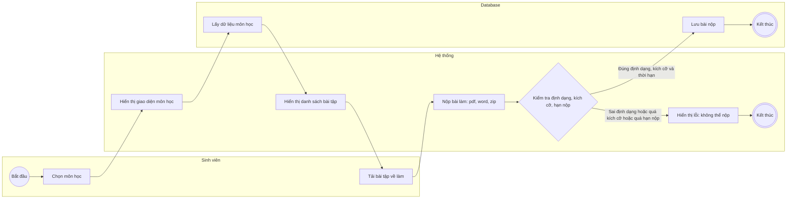

# Activity — Làm bài tập (Swimlanes)

```mermaid
flowchart LR
  %% Bố cục trái sang phải để mô phỏng 3 lane
  %% Mỗi lane là 1 subgraph

  subgraph SV["Sinh viên"]
    direction TB
    sv_start((Bắt đầu))
    sv_chon[Chọn môn học]
    sv_tai[Tải bài tập về làm]
  end

  subgraph SYS["Hệ thống"]
    direction TB
    sys_show[Hiển thị giao diện môn học]
    sys_list[Hiển thị danh sách bài tập]
    sys_upload[Nộp bài làm: pdf, word, zip]
    sys_check{Kiểm tra định dạng, kích cỡ, hạn nộp}
    sys_err[Hiển thị lỗi: không thể nộp]
    sys_end(((Kết thúc)))
  end

  subgraph DB["Database"]
    direction TB
    db_fetch[Lấy dữ liệu môn học]
    db_save[Lưu bài nộp]
    db_end(((Kết thúc)))
  end

  %% Luồng chính
  sv_start --> sv_chon --> sys_show
  sys_show --> db_fetch --> sys_list
  sys_list --> sv_tai --> sys_upload
  sys_upload --> sys_check

  %% Rẽ nhánh kiểm tra
  sys_check -->|Sai định dạng hoặc quá kích cỡ hoặc quá hạn nộp| sys_err --> sys_end
  sys_check -->|Đúng định dạng, kích cỡ và thời hạn| db_save --> db_end
```
