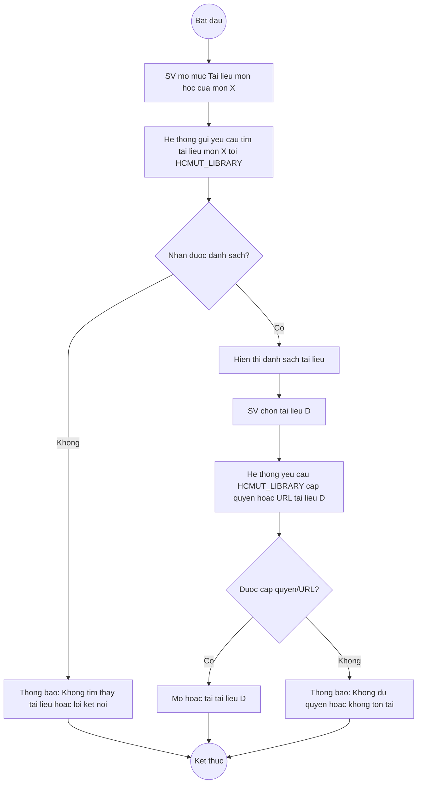

# UC — Truy cập Tài liệu Môn học (Activity Diagram)

Tiền điều kiện
- Sinh viên đã đăng nhập.
- Hệ thống đã kết nối được với HCMUT_LIBRARY.

## Sơ đồ hoạt động

```mermaid
flowchart TD
  A(("Bắt đầu"))
  B[SV mở mục Tài liệu môn học của môn X]
  C[Hệ thống gửi yêu cầu tìm tài liệu môn X tới HCMUT_LIBRARY]
  D{Nhận được danh sách?}
  E[Hiển thị danh sách tài liệu (tiêu đề, loại, liên kết)]
  F[SV chọn tài liệu D]
  G[Hệ thống yêu cầu HCMUT_LIBRARY cấp quyền hoặc URL tài liệu D]
  H{Được cấp quyền/URL?}
  I[Hiển thị hoặc tải tài liệu D]
  J[Thông báo: Không đủ quyền hoặc không tồn tại]
  K[Thông báo: Không tìm thấy tài liệu liên quan từ thư viện hoặc lỗi kết nối]
  Z(("Kết thúc"))

  A --> B --> C --> D
  D -->|Có| E --> F --> G --> H
  D -->|Không| K --> Z
  H -->|Có| I --> Z
  H -->|Không| J --> Z
```

## Bản dự phòng (ASCII, nếu gặp lỗi render do ký tự có dấu)


