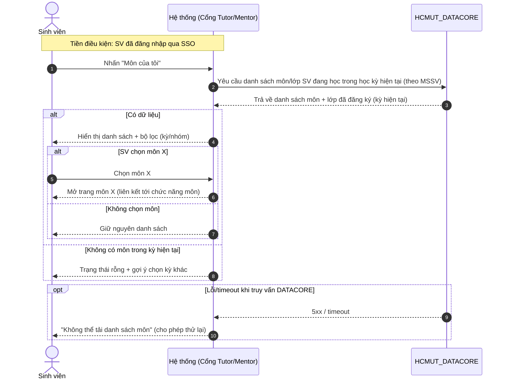

# UC2 — Xem danh sách môn học (diễn đạt dễ hiểu)

```mermaid
sequenceDiagram
  autonumber
  actor SV as Sinh viên
  participant SYS as Hệ thống (Cổng Tutor/Mentor)
  participant DC as HCMUT_DATACORE

  Note over SV,SYS: Tiền điều kiện: SV đã đăng nhập qua SSO

  SV->>SYS: Nhấn "Môn của tôi"
  SYS->>DC: Yêu cầu danh sách môn/lớp SV đang học trong học kỳ hiện tại (theo MSSV)
  DC-->>SYS: Trả về danh sách môn + lớp đã đăng ký (kỳ hiện tại)

  alt Có dữ liệu
    SYS-->>SV: Hiển thị danh sách + bộ lọc (kỳ/nhóm)
    alt SV chọn môn X
      SV->>SYS: Chọn môn X
      SYS-->>SV: Mở trang môn X (liên kết tới chức năng môn)
    else Không chọn môn
      SYS-->>SV: Giữ nguyên danh sách
    end
  else Không có môn trong kỳ hiện tại
    SYS-->>SV: Trạng thái rỗng + gợi ý chọn kỳ khác
  end

  %% Luồng lỗi tích hợp
  opt Lỗi/timeout khi truy vấn DATACORE
    DC-->>SYS: 5xx / timeout
    SYS-->>SV: "Không thể tải danh sách môn" (cho phép thử lại)
  end
```
