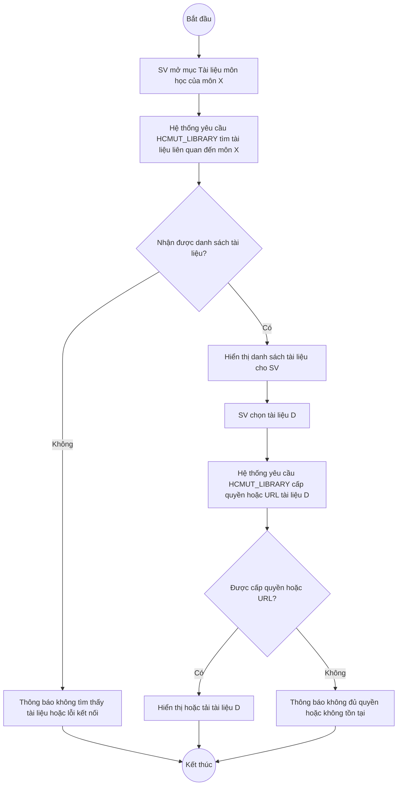
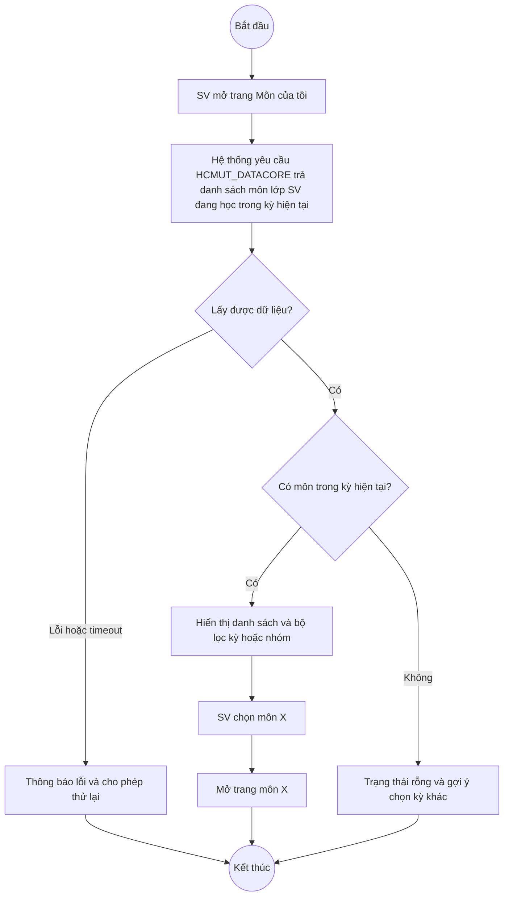
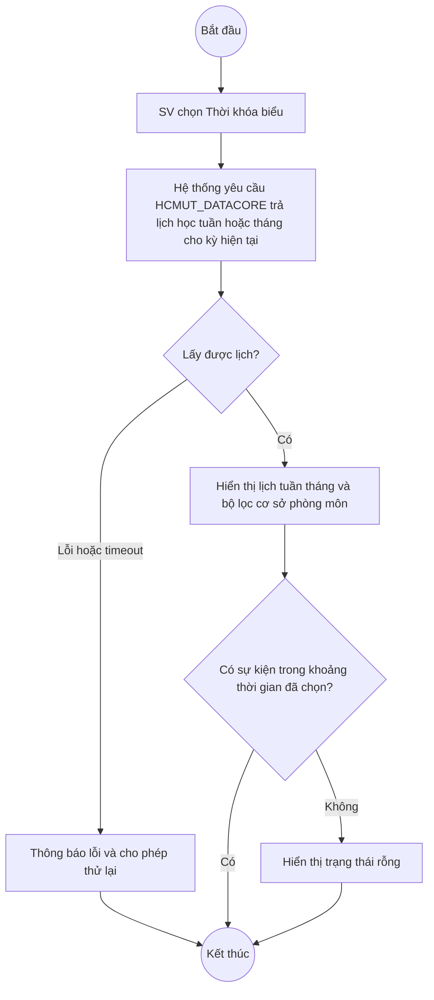
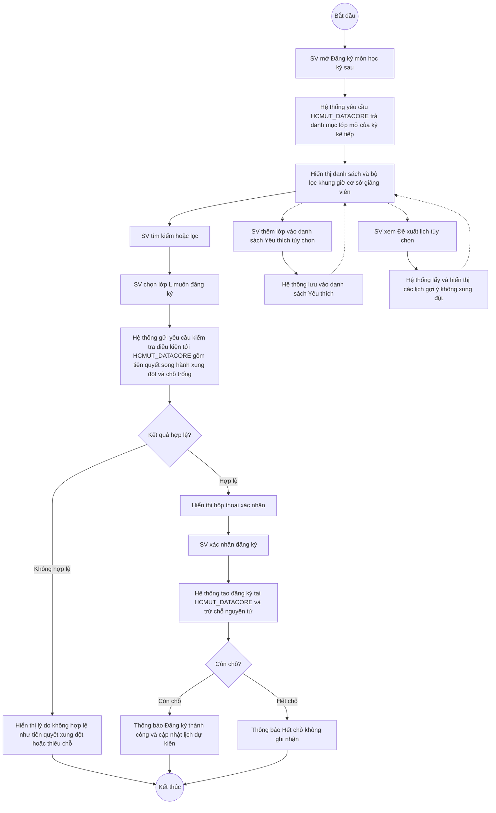

# Activity Diagrams — Student Use Cases (HCMUT Tutor/Mentor)

Bao gồm 4 use case phía Sinh viên:
- Truy cập tài liệu môn học
- Xem danh sách môn học (đang học)
- Xem thời khóa biểu
- Đăng ký môn học kỳ sau

---

## UC — Truy cập tài liệu môn học

---

## UC — Xem danh sách môn học (đang học)

---

## UC — Xem thời khóa biểu

---

## UC — Đăng ký môn học kỳ sau

