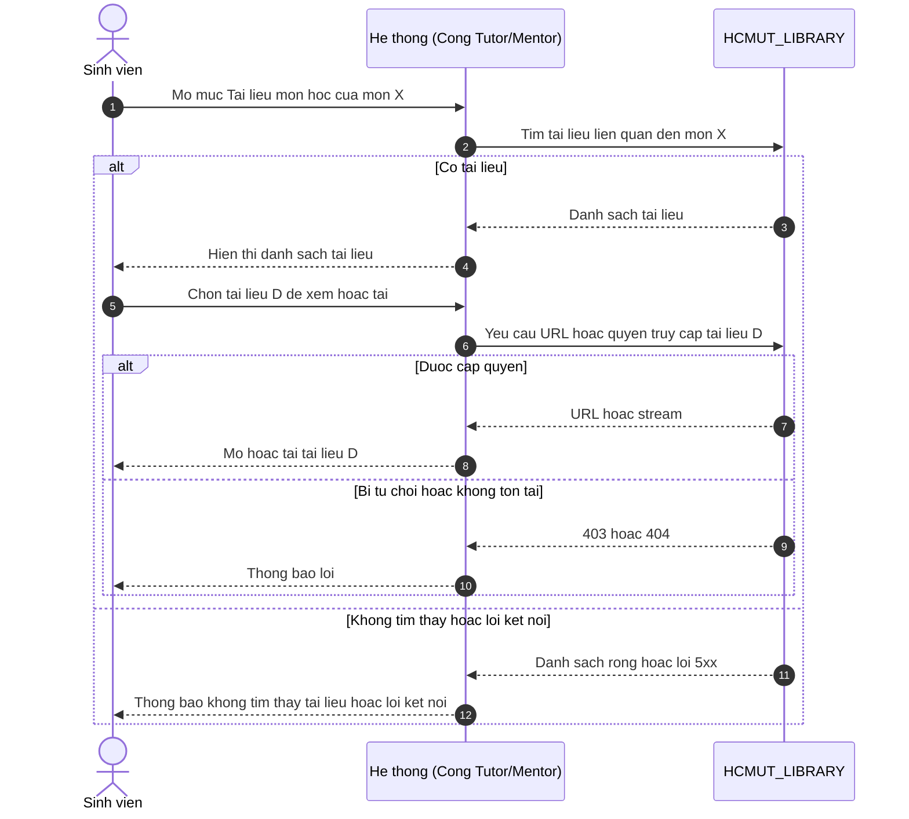

# UC — Truy Cập Tài Liệu Môn Học (Access Course Materials)

Tiền điều kiện
- Sinh viên đã đăng nhập qua SSO.
- Hệ thống đã kết nối với HCMUT_LIBRARY.  

```mermaid
sequenceDiagram
  autonumber
  actor SV as Sinh vien
  participant SYS as He thong (Cong Tutor/Mentor)
  participant LIB as HCMUT_LIBRARY

  SV->>SYS: Mo muc Tai lieu mon hoc cua mon X
  SYS->>LIB: Tim tai lieu lien quan den mon X

  alt Co tai lieu
    LIB-->>SYS: Danh sach tai lieu
    SYS-->>SV: Hien thi danh sach tai lieu
    SV->>SYS: Chon tai lieu D de xem hoac tai
    SYS->>LIB: Yeu cau URL hoac quyen truy cap tai lieu D
    alt Duoc cap quyen
      LIB-->>SYS: URL hoac stream
      SYS-->>SV: Mo hoac tai tai lieu D
    else Bi tu choi hoac khong ton tai
      LIB-->>SYS: 403 hoac 404
      SYS-->>SV: Thong bao loi
    end
  else Khong tim thay hoac loi ket noi
    LIB-->>SYS: Danh sach rong hoac loi 5xx
    SYS-->>SV: Thong bao khong tim thay tai lieu hoac loi ket noi
  end
```
